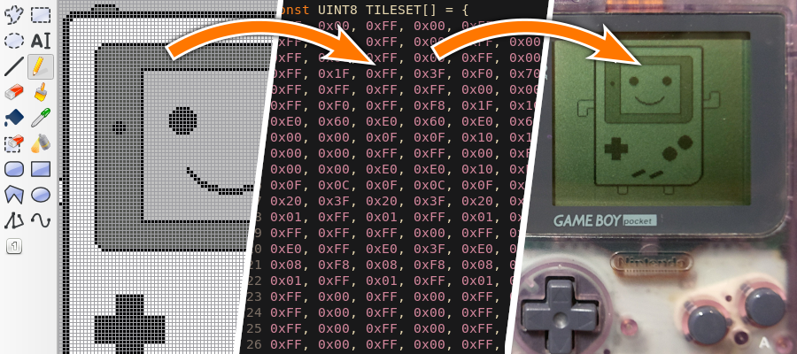

img2gb - Converts Images to GameBoy Tileset and Tilemap
=======================================================

|Build Status| |PYPI Version| |License|

    img2gb generates GameBoy Tilesets and Tilemaps from standard image (PNG,
    JPEG,...). It converts the images into the GameBoy image format and
    generates C code (``.c`` and ``.h`` files) that can be used in GameBoy
    projects.

* Documentation: https://flozz.github.io/img2gb/
* HowTo: https://flozz.github.io/img2gb/howto.html

Dependencies
------------

* Python 2.7 / 3.5
* Pillow

Install
-------

* See https://flozz.github.io/img2gb/install.html

Usage
-----

* See https://flozz.github.io/img2gb/cli.html

Hacking
-------

To work on img2gb first create a virtualenv::

    python3 -m venv __env__

and activate it::

    source __env__/bin/activate

Then install the project will all devs dependencies::

    pip install -e .[dev]

You can now lint the code::

    nox -s lint

You can fix codding style using Black::

    nox -s black_fix

And you can run tests::

    nox -s test       # Run on all Python version
    nox -s test-3.7   # Run on Python 3.7
    nox -s test-3.8   # Run on Python 3.8
    nox -s test-3.9   # Run on Python 3.9
    nox -s test-3.10  # Run on Python 3.10

Links
-----

* Examples of GameBoy programs that uses img2gb for graphics:
  * https://github.com/flozz/gameboy-examples/tree/master/05-graphics2
  * https://github.com/flozz/gameboy-examples/tree/master/06-graphics3-background
* Article about the tile encoding and img2gb: https://blog.flozz.fr/2018/11/19/developpement-gameboy-5-creer-des-tilesets/ (French)

Changelog
---------

* **1.1.0:**

  * Removes arbitrary size limit for tilmaps
  * Implements ``offset`` option (#2)

* **1.0.0:**

  * Refacto of the Python API, with new high-level fuction to be easier to use
  * Refacto of the CLI: now tileset and tilemap are generated separately, this allow more options for both and covers more usecases.
  * New option to handle alternative palette
  * New option to handle 8x16px sprites
  * Documentation
  * Unit test (everything is not coverd but it is better than nothing :))

* **0.10.0:** Adds non-RGB image support (indexed images,...)
* **0.9.1:** Fixes an issue with Python 3
* **0.9.0:** Initial release (generates tiles, tilesets and tilemaps)

.. |Build Status| image:: https://travis-ci.org/flozz/img2gb.svg?branch=master
   :target: https://travis-ci.org/flozz/img2gb
.. |PYPI Version| image:: https://img.shields.io/pypi/v/img2gb.svg
   :target: https://pypi.python.org/pypi/img2gb
.. |License| image:: https://img.shields.io/pypi/l/img2gb.svg
   :target: https://github.com/flozz/img2gb/blob/master/LICENSE
